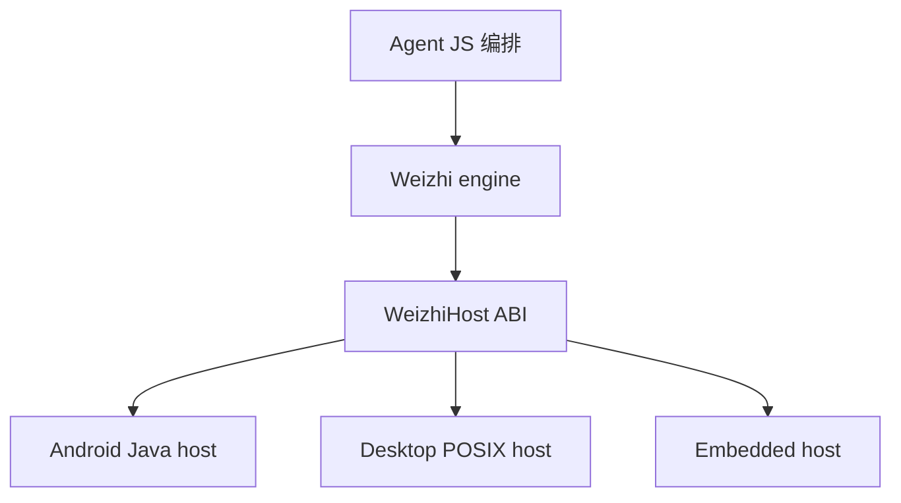
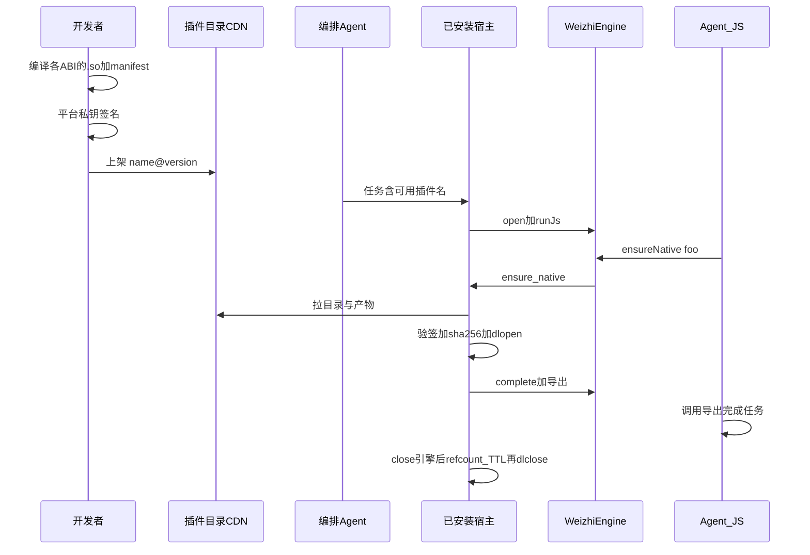
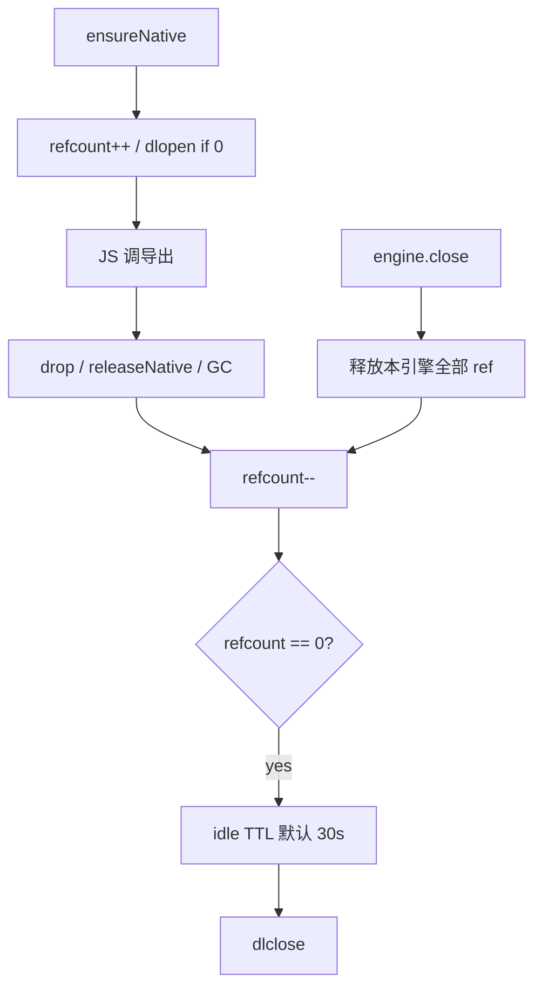

# Weizhi Host ABI

宿主与引擎之间的能力约定。引擎提供稳定的 QuickJS 表面、限额与完成队列；**平台差异与原生扩展由宿主填**。Agent 只写 JS 编排，不直接碰 SO / 网络实现细节。

相关文档：[DECISIONS.md](DECISIONS.md)（已实现规格）、[AGENT_SANDBOX_PROMPT.md](AGENT_SANDBOX_PROMPT.md)（给 Agent 的契约）。

> 本文件为 Host ABI 设计。主干已落地：`fetch` / VFS，以及 **`host.ensureNative`（下载/验签/dlopen 可先由宿主模拟）**。Android：`WeizhiEngine.enableNativeMock()`。

## 1. 分层



- **引擎**：QuickJS、`runJs`、Promise 完成队列、Agent 友好英文错误、限额。
- **宿主**：真实 I/O、网络、压缩、**签名原生 SO**；**永不**从线程池直接进入 QuickJS。
- 未实现能力 → `unsupported: ...` + 如何补宿主 / Agent 可改什么。

**产品重心**：Agent 任务多为简单逻辑编排，很少手写重算法。**签名 SO 是一等扩展路径**。Wasm / `loadPack` 已从主干移除，完整实现保存在分支 `archive/wamr-packs`，需要时再合回。

## 2. 能力位（caps）

宿主在 open 时声明 bitmask；JS 只读查询（建议 `process.weizhiCaps`，实现时再定名）。

| Cap | 含义 | JS 表面 | 主干现状 |
| --- | --- | --- | --- |
| VFS | 沙箱文件 | `fs` / `fs.promises` | 已有 |
| HTTP | 网络 | `fetch` | 已有 `weizhi_set_http` / `enableFetch` |
| LOG | 结构化日志 | host log | 已有 `weizhi_set_log` |
| RANDOM | 熵 | `crypto.getRandomValues` / `crypto.randomUUID` | 已有（`/dev/urandom`） |
| COMPRESS | gzip/deflate | `require("zlib")` 的 `gzipSync` / `gunzipSync` / `deflateSync` / `inflateSync` | 已有 |
| HASH | sha256 等 | digest / `host.hash` | 建议新增（验签插件） |
| NATIVE | 签名原生插件 | `host.ensureNative(name)` | 已有 C API + Android `enableNativeMock`（目录/验签模拟） |
| UI / IMAGE | 位图/相册等 | 后置 | 本阶段 out of scope |

应用级扩展仍可用 `addFunction`（不替代 NATIVE 目录生态）。

## 3. 异步完成约定

所有 async host 操作：

1. 开始：返回 0 + `request_id`
2. 结束：仅 `weizhi_complete` / `weizhi_complete_fetch`（可扩展 `weizhi_complete_json`）
3. 错误字符串：英文关键词 + 下一步（与 DECISIONS 表一致）

## 4. 发版后新增插件 SO（端到端）

前提：用户已安装的 App 已带齐 `NATIVE` + `HASH` + 下载用 HTTP，以及**插件目录基址**与**验签公钥**。之后上新 SO **不必**再发 App Store 版。

若旧客户端没有 NATIVE 接线，必须先推一次 App，再谈「只上架 SO」。



### 4.1 开发者上架

1. 实现纯 C ABI 插件（**禁止 `JNI_OnLoad`**），导出表写入 `manifest.json`。
2. 为各 ABI 产出 `libfoo.so`（或统一包内多 ABI）。
3. Manifest 字段（schema 实现时写死）：
   - `name`（稳定 ID，如 `image_resize`）
   - `version`（semver）
   - `min_host_abi`（整数，对应 `WEIZHI_HOST_ABI_VERSION`）
   - `exports[]`
   - `artifacts[]`：`{ abi, url, sha256, size }`
   - `caps_required`（如需相册等系统权限，宿主可拒）
4. 用**平台私钥**签名；公钥预置在已发版 App。
5. 上传到**仅 Host 知道的目录 CDN**；脚本**不得**任意 URL `dlopen`。
6. 可选：把 `name` + 简介同步进编排 Agent 工具列表。

### 4.2 用户侧（已装客户端，零发版）

1. Agent JS 只调用 `host.ensureNative("foo")`（**只传 name**）。
2. 宿主：缓存命中则升 refcount；否则拉目录 → 选 arch → 下载到私有目录 → **验签 + sha256** → `dlopen` → 按 manifest 挂导出。
3. 失败示例：
   - `unsupported: native "foo" (not in catalog)`
   - `native verify failed: signature`
   - `native incompatible: min_host_abi 3 > host 2`
   - `native download failed: ...`
4. 任务结束 `close` 引擎；refcount/TTL 后 `dlclose`；磁盘缓存可保留。

### 4.3 发现与下架

- **目录是唯一真相**；Agent 只按 name 请求。
- 下架：目录删条或 `disabled`；缓存可按策略清理；使用中的等 refcount 归零。

### 4.4 版本

- `ensureNative("foo")` 默认解析为满足 `min_host_abi` + 本机 arch 的**最新兼容**版。
- 可选钉版本：`ensureNative("foo", { version: "1.2.0" })`（可二期）。
- 坏版本：目录回滚或发补丁版；下次 ensure 拉新 hash。

### 4.5 何时仍要发 App

| 变更 | 要发 App？ |
| --- | --- |
| 新插件 SO / 新版本 SO | 否 |
| 新 Host ABI cap / 改回调签名 | 是 |
| 插件需新系统权限 | 通常要 |
| 验签公钥轮换 | 要（或双钥过渡） |

## 5. 原生 SO 生命周期（省内存）

### A. `libweizhijni.so`

进程内**不卸载**。省内存靠 `WeizhiEngine.close()` / `weizhi_close()`（释放 JS 堆、async 池等）。会话结束即 close。

### B. 宿主签名插件 `.so`



锁定规则：

1. 按插件名**全局 refcount**（跨引擎共享映射）。
2. `ensureNative` → ++；JS 丢 handle / `releaseNative` / **engine close** → --。
3. refcount==0 后 **idle TTL 默认 30s** 再 `dlclose`；`onTrimMemory` 可立即卸 idle 插件。
4. 脚本不可 `dlclose`；禁止有 in-flight 调用时卸（refcount 保证）。
5. 插件 SO **不得**注册 JNI。

卸载后再调：`unsupported: native "..." (released; call ensureNative again)`。

## 6. 版本与兼容

- `WEIZHI_HOST_ABI_VERSION`（整数）。
- 新 cap **只增**不改旧回调签名；老宿主无位 → JS `unsupported`。
- Java `WeizhiEngine` 为默认 Host 实现；纯 C 嵌入式自备 Host。

## 7. 第三方集成清单

| 目标 | 需要 |
| --- | --- |
| 最小可跑 | Limits +（可选默认 VFS）+ `runJs` |
| Agent 可用网络 | + HTTP |
| 插件生态 | + NATIVE + HASH + 目录 URL/公钥 |
| 会话结束 | 务必 `close` 引擎 |
| **Android App 集成** | 依赖 `:weizhi` AAR（或将来 Maven 坐标）；`new WeizhiEngine()`；`enableFetch` 时宿主 Manifest 声明 `INTERNET` |

构建：`./scripts/build-android.sh` → `cd android && gradle :weizhi:assembleRelease` → `weizhi/build/outputs/aar/weizhi-release.aar`。

## 8. Wasm 归档说明

主干**不再**依赖 WAMR，无 `loadPack` / `setPackFolder`。历史实现（含 AOT、pack 真机基准）在：

```text
git branch archive/wamr-packs
```

需要 Wasm 能力时从该分支恢复或 cherry-pick，不要在主干留半套 ifdef。
